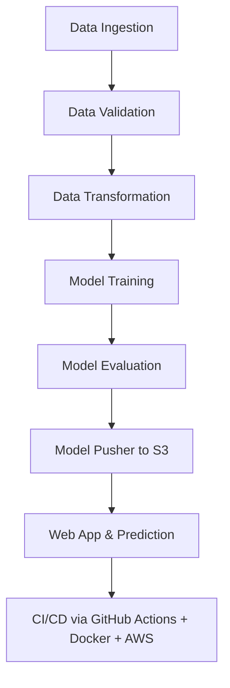

# ChurnCast - The Autonomous Retention Intelligence Engine
**ChurnCast** represents the fusion of meticulous data science and robust MLOps automation, engineered to proactively identify customers at risk of churning with an exceptional performance. It's a comprehensive demonstration of the entire machine learning lifecycle, from deep statistical analysis and insight-driven feature engineering to a fully containerized, CI/CD-driven deployment on AWS. The result is a self-sustaining intelligence engine that is as scientifically rigorous as it is operationally resilient.

---


## 🌐 Tech Stack

* **Languages**: Python 3.10
* **Data Storage**: MongoDB Atlas, AWS S3
* **Deployment**: Docker, AWS (EC2, ECR), GitHub Actions
* **Data Science/ Machine Learning**: scikit-learn, pandas, Tensorflow, keras, NumPy, Imbalanced-learn, Dill, XAI (Explainable AI), Matplotlib, Plotly, Missingno, express, seaborn
* **MLOps/DevOps Tools**: GitHub Actions, Docker, PyProject, Conda
* **Frontend**: HTML, CSS, Jinja2
* **Backend**: Python, FastAPI, Uvicorn

---
## 📁 Project Structure and Setup

```
📦ChrunCast
 ┣ 📂src
 ┃ ┣ 📂components
 ┃ ┣ 📂data_access
 ┃ ┣ 📂aws_storage
 ┃ ┣ 📂configuration
 ┃ ┣ 📂entity
 ┃ ┣ 📂pipeline
 ┃ ┗ 📜utils
 ┣ 📂notebook
 ┣ 📂static
 ┣ 📂templates
 ┣ 📜app.py
 ┣ 📜requirements.txt
 ┣ 📜Dockerfile
 ┣ 📜.dockerignore
 ┣ 📜setup.py
 ┣ 📜pyproject.toml
 ┗ 📜README.md
```
---

### Project Template Creation

Run `template.py` to automatically generate a clean project structure:

```bash
python template.py
```

This creates all essential modules and files, including:

```
src/
├── components/
│   ├── data_ingestion.py, model_trainer.py, ...
├── configuration/
│   ├── mongo_db_connection.py, aws_connection.py
├── cloud_storage/
├── data_access/
├── entity/
├── pipeline/
├── utils/
├── exception/, logger/
```

---

## 🧰 Environment Setup

### 2️⃣ Local Package Management

Configure `setup.py` and `pyproject.toml` to register local packages. 

### 3️⃣ Create Virtual Environment

```bash
py=3.10 -m venv venv
pip install -r requirements.txt
pip list  # verify installations
```

---

## 🍃 MongoDB Atlas Setup

### 4️⃣ Steps to Configure MongoDB Atlas

1. Create an account on [MongoDB Atlas](https://www.mongodb.com/cloud/atlas).
2. Create new **M0 cluster** → Define a user with password.
3. Add IP: `0.0.0.0/0` for access from all IPs.
4. Get the **Python connection string**.

### 5️⃣ Push Dataset to MongoDB

* Create a `notebook/` folder and add your dataset.
* Use `mongoDB_demo.ipynb` to:

  * Load dataset
  * Push to MongoDB
  * Validate data in Atlas → *Browse Collections*


---


## 6️⃣ Logging and Exception Handling

* Add logging logic in `src/logger/__init__.py`
* Add exception logic in `src/exception/__init__.py`
* Testing using `demo.py`

##  Exploratory Data Analysis & Key Insights
The foundation of ChurnCast was built upon a deep Exploratory Data Analysis (EDA) to understand the underlying patterns, correlations, and characteristics of the customer dataset. The process was systematic, leveraging tools like Pandas for data manipulation, Matplotlib, plotly and Seaborn for rich visualizations, and Missingno for a clear view of data completeness.

The methodology involved a **multi-layered approach** to dissect the data from every angle:

**Initial Data Assessment**: The analysis began by examining the dataset's structure (`.info()`) and statistical summaries (`.describe()`). The `missingno.matrix` visualization was crucial for confirming the presence and pattern of missing values across features, which directly informed the `multi-stage imputation` strategy.

**Univariate Analysis**: The distribution of each feature was analyzed individually to understand its characteristics.
 - For numerical features, distributions were visualized using `histplots` and `kdeplots` to identify skewness, while `boxplots` were used to detect potential outliers.

 - For categorical features, `countplots` and `pie charts` were used to understand the balance of classes (e.g., Churn vs. No Churn proportions).

**Bivariate & Multivariate Analysis**: This was the core of the EDA, where relationships between variables were uncovered using a variety of plots. A `correlation heatmap` provided a high-level overview of linear relationships. Deeper insights were gained using:

- `Violin Plots`: To compare the distribution of a numerical variable across different categories (e.g., Tenure by MaritalStatus), combining the benefits of a box plot and a KDE plot.

- `Grid Plots & Faceting`: To create comprehensive multivariate views and compare relationships across different segments simultaneously.

- Targeted `groupby` Aggregations: To calculate precise statistics (like mean churn rate) within specific customer segments, turning visual insights into hard numbers.


**Key Findings:**

- High-Risk Customer Segments Identified:

  - **Gender Disparity**: Bivariate analysis using count plots and cross-tabulations revealed a significant gender imbalance in churn, with males accounting for 63.3% of the total churned population, pointing to a potential product-market mismatch for this demographic.

   - **Marital Status**: `groupby` aggregations showed that while married customers form the largest user base, single customers are disproportionately more likely to churn, highlighting a key segment for targeted retention campaigns.

   - **Login Device**: A high churn rate among mobile phone users was identified, strongly suggesting that potential UI/UX friction within the mobile app is a significant driver of churn. This insight directly led to a recommendation for a technical audit of the mobile platform.

- **Purchase Behavior & Loyalty Indicators**:

  - **Positive Engagement**: Correlation analysis showed that churn risk decreases significantly as a customer's `OrderAmountHikeFromlastYear` increases, with the 12-15% hike threshold appearing as a critical loyalty milestone. Increased `CouponUsed` also correlated strongly with lower churn.

  - **Cashback Paradox**: A counter-intuitive positive correlation between `CashbackAmount` and `Churn` was discovered. This suggests that high cashback offers may be attracting less loyal, "deal-seeking" customers who leave after securing a deal, indicating a need to rethink the incentive structure for long-term retention.

- **Ineffective Feedback Metrics**:

  Analysis showed a weak or non-existent correlation between both `SatisfactionScore` and the formal `Complain` metric with the actual `Churn` outcome. This critical insight revealed that these channels are not capturing the true drivers of customer dissatisfaction and are unreliable for proactive retention, justifying the development of a more intelligent predictive model.

### **Actionable Recommendations from EDA**:

Based on these findings, several data-driven business strategies were proposed:

**Refine Product Strategy**: Investigate and expand product categories that appeal to male and single customers and conduct a thorough UI/UX audit of the mobile application.

**Optimize Loyalty Programs**: Focus retention efforts on customers reaching the 12-15% order amount hike milestone and re-evaluate the cashback strategy to incentivize long-term loyalty.

**Improve Feedback Loop**: Develop more direct feedback channels, such as proactive surveys, as the current systems are not reliable predictors of churn.

# A Journey Through the Automated Pipeline:


## Data Ingestion & Validation: 

The pipeline begins by automatically sourcing customer data from a `MongoDB database`. A rigorous validation schema ensures data integrity, checking for correct data types and column structures, guaranteeing that only high-quality data enters the transformation stage.

**Data Ingestion Implementation**

 - Define MongoDB connector in configuration/mongo_db_connection.py

 - Access and transform data using data_access/proj1_data.py

 - Configure ingestion in:

   - entity/config_entity.py
   - entity/artifact_entity.py
 - Logic in components/data_ingestion.py

 - constants in constants/__init__.py

 - Run ingestion via pipeline/training_pipeline.py

## Data Validation
Once ingested, the data doesn't immediately enter the transformation stage. Instead, it is passed through a rigorous, automated Data Validation component. This step is critical for maintaining the stability and reliability of the entire ML system.

The validation process is entirely schema-driven, using a central schema.yaml file as the single source of truth for the expected data structure. This is a key MLOps practice that decouples the validation logic from the code.

The validation component systematically performs the following checks on both the training and testing datasets:

 - **Column Presence & Integrity**: It verifies that all columns specified in the `schema.yaml` exist in the ingested data. This immediately catches errors caused by upstream changes, such as a column being accidentally dropped or renamed.

 - **Data Type Conformance**: It meticulously checks that the data type of each column (e.g., `int64`, `float64`, `object`) exactly matches the data type defined in the schema. This prevents silent errors and pipeline failures during the transformation or training stages, which often expect specific numerical or categorical formats.

 - **Generation of an Auditable Report**: Upon completion, the component generates a `validation_report.yaml`. This report serves as an auditable artifact, providing a clear and immediate status (pass/fail) of the data's quality. If validation fails, the pipeline is designed to halt immediately, preventing corrupt data from propagating downstream.

By enforcing a strict data contract through this schema, the Data Validation component guarantees that only clean, reliable, and correctly structured data proceeds to the EDA and transformation stages, ensuring the robustness and reproducibility of the entire project.

 - Schema defined in `config/schema.yaml`
 - validation logic in `utils/main_utils.py`
 - Implement validation logic in `components/data_validation.py`
### Insight-Driven Data Transformation: 
The foundation of ChurnCast was built upon a deep Exploratory Data Analysis (EDA), which revealed the unique characteristics of the dataset. This informed a bespoke preprocessing strategy:

 - **Strategic Imputation**: Instead of a generic approach, a `multi-stage imputation` process was designed. `IterativeImputer (MICE)` was used for features with complex interdependencies, `K-Nearest Neighbors (KNN) Imputer` was applied to behavioral metrics, and a robust `SimpleImputer` handled straightforward transactional data. This tailored strategy ensured that the integrity and predictive power of the data were maximized.

 - **Advanced Encoding**: To handle categorical variables, `Target Encoding` was deliberately chosen over traditional methods. This prevented the `curse of dimensionality` that plagues One-Hot Encoding and avoided the `false ordinality` that can be introduced by Label Encoding, enriching the feature set with valuable statistical information.

 - **Handling Class Imbalance**: The inherent class imbalance was meticulously addressed. Both `SMOTEENN` and `SMOTETomek` resampling techniques were implemented and evaluated, with SMOTEENN ultimately being selected for its superior ability to improve the model's F1-score and generalization on unseen data.

 - **Feature Creation**: A new, powerful feature, `Digital_Engagement`, was engineered by combining `HourSpendOnApp` and `NumberOfDeviceRegistered` to create a more potent indicator of customer interaction.

- **Encapsulated Transformation Pipeline**: All of these intricate steps—`sequential imputation`, `target encoding`, `feature engineering`, `outlier handling`, and `scaling`—are encapsulated into a single, portable scikit-learn pipeline object. This ensures that the exact same transformations are applied flawlessly during training, evaluation, and real-time prediction, eliminating any chance of training-serving skew.

- Transform logic in `components/data_transformation.py`
- Use `entity/estimator.py` for transformation classes

## Exhaustive Modeling & Experimentation: 
The path to the final `0.99` `recall` and `precision score` as well as `98% accurate model` was paved with rigorous experimentation:


- **Broad-Spectrum Exploration**: The initial discovery phase explored a wide range of modeling paradigms, from leveraging AutoML platforms for baseline performance metrics to designing and training custom Neural Networks.

 - **Hyperparameter Tuning & Cross-Validation**: The final XGBoost model was not a default implementation. It was meticulously refined through extensive hyperparameter tuning, with its robustness and consistency validated using K-Fold Cross-Validation.

 - **Advanced Performance Metrics**: The model's success was measured beyond simple accuracy. A suite of advanced classification metrics, including F-beta scores (to weigh recall higher than precision) and Cohen's Kappa, were used to ensure its effectiveness in a real-world, imbalanced data scenario.

```
Implemented model training in components/model_trainer.py
Updated estimator utilities in entity/estimator.py
```
## Deep Learning Exploration: Architecting a Custom Neural Network
To ensure the highest possible performance, the project extended beyond traditional machine learning models to explore deep learning solutions. A custom Artificial Neural Network (ANN) was designed from scratch using TensorFlow and Keras, validating that the chosen model was indeed the best fit for the problem. After tuning prameters like activation functions, number of layers, nuerons in layers, optimizer, learning rate, etc , I finally acheived performance almost comparable to the best performing ML model XGBClassifier after running for 100 epochs.

- **Custom Architecture**: A Multi-Layer Perceptron (MLP) was architected with two hidden layers using tanh activation functions to capture non-linear patterns, and a final sigmoid output layer perfectly suited for the binary classification task.

- **Addressing Class Imbalance**: The significant class imbalance discovered during EDA was a critical challenge. The model was trained using a strategic class_weight parameter, which assigns a higher penalty to classification errors on the minority (churn) class. This forced the network to pay closer attention to the signals of churning customers, dramatically improving its real-world effectiveness.

- **Exceptional Performance**: This custom-built ANN proved highly effective, achieving an overall 97% accuracy, and an impressive F1-score of 0.97 for the churn class. This demonstrated performance is almost comparable with the final, highly-tuned XGBoost model.


## Explainable AI (XAI) for Actionable Insights
ChurnCast is not a `"black box."` Explainable AI (XAI) techniques have been applied to the final model to interpret its predictions. This allows stakeholders to understand the key drivers behind why a customer is flagged as a churn risk, turning a simple prediction into an actionable business insight.

### Model Training

* Implemented model training in `components/model_trainer.py`
* Update estimator utilities in `entity/estimator.py` 

## Automated Model Evaluation: The Quality Gatekeeper
This component serves as the critical automated quality gate for the entire pipeline, ensuring that only superior models are promoted to production. Its primary role is to prevent "model degradation" by making a data-driven decision on whether a newly trained model outperforms the one currently in service.

The evaluation process follows a classic Champion vs. Challenger methodology:

- **Benchmarking the Challenger**: The newly trained model (the "challenger") is loaded from the `model_trainer` artifact. Its performance is rigorously benchmarked against the held-out, transformed test set (`transformed_test.npy`), which it has never seen before.

- **Retrieving the Champion**: The current production model (the "champion") is retrieved from its permanent home in the Amazon S3 model registry. If no champion model exists (as in the very first pipeline run), the challenger is automatically accepted.

- **Fair and Rigorous Comparison**: Both models are evaluated on the exact same raw test dataset to ensure a fair, apples-to-apples comparison. The champion model, which contains the full preprocessing pipeline, is able to transform this raw data itself, demonstrating its real-world predictive capability.

- **Multi-Faceted Performance Metrics**: While the final automated go/no-go decision in the code is driven by the F1-score (chosen for its robustness on imbalanced datasets), the model's overall health and business value are assessed using a comprehensive suite of metrics that were established during the experimentation phase. This includes:

  - **Precision and Recall**: To understand the trade-offs between false positives and false negatives.

  - **F-beta Scores**: Specifically used to assign more weight to recall, which is crucial in a churn problem where failing to identify a churning customer (a false negative) is more costly than mistakenly flagging a loyal one.

  - **Cohen's Kappa Score**: To measure the model's performance while accounting for the possibility of correct predictions occurring by chance.
  - **AUC-ROC Score**: To evaluate the model's ability to distinguish between the positive (Churn) and negative (No Churn) classes. A high AUC value indicates that the model is excellent at ranking customers by their probability of churning.

- **The Final Verdict**: An artifact is generated containing a simple boolean flag: `is_model_accepted`. If the challenger model demonstrates a statistically significant performance improvement over the champion, this flag is set to True. This artifact acts as a signal, authorizing the `ModelPusher` component to proceed with deploying the new, superior model to the production environment.

* Evaluate new model vs old using logic in `components/model_evaluation.py`
---


## ☁️ AWS Setup for Model Deployment

### AWS IAM and S3

* Create an IAM User with `AdministratorAccess`
* Generate and download **Access Key & Secret**
* Add credentials as ENV vars:

```bash
# Bash
export AWS_ACCESS_KEY_ID="XXX"
export AWS_SECRET_ACCESS_KEY="XXX"
```

* Add to `constants/__init__.py`:

```python
MODEL_BUCKET_NAME = "churncast"
MODEL_PUSHER_S3_KEY = "churncastkey"
MODEL_EVALUATION_CHANGED_THRESHOLD_SCORE = 0.03
```

###  S3 Bucket Creation

* Go to S3 → Create bucket → `churncast` (Region: `us-east-1`)
* Uncheck “Block all public access”

###  S3 Logic

* Write push/pull logic in:

  * `cloud_storage/aws_storage.py`
  * `entity/s3_estimator.py`

---

### Model Pusher

* Push the final model to S3 in `components/model_pusher.py`

## Live Prediction Pipeline & Inference
The project includes a robust prediction pipeline designed to serve real-time predictions on new, unseen data via a FastAPI web endpoint. This component is critical for operationalizing the model and turning its insights into actionable results.

The inference process is engineered for reliability and consistency:

- **Structured Data Input**: A dedicated ChurnData class is used to structure incoming raw data (e.g., from a web form) into a pandas DataFrame. This class also cleverly injects placeholder ID columns, ensuring the data format perfectly matches what the pre-trained pipeline expects.

- **Model Retrieval from Cloud Registry**: The ChurnPredictor class interfaces with an s3_estimator to load the complete, production-ready model pipeline directly from the AWS S3 model registry. This ensures that the application always uses the officially promoted "champion" model.

- **Preventing Training-Serving Skew**: To guarantee prediction consistency and prevent errors, the pipeline performs two crucial checks:

- **Dependency Management**: It explicitly imports the custom transformer classes (NotebookImputer, TargetEncoder, etc.). This is essential for Python's pickle to correctly reconstruct the saved pipeline object with its custom components.

- **Schema Enforcement**: Before prediction, it references the project's schema.yaml to reorder the incoming DataFrame's columns to exactly match the order used during training. This eliminates common ValueError exceptions related to feature order mismatch.
---

## 🔧 Web UI + Prediction

### Prediction Pipeline

* Add logic to `pipeline/prediction_pipeline.py`
* Implement web backend in `app.py`

### Static and Template Setup

* Add `static/` and `templates/` for Flask UI
* Display prediction outputs via HTML interface


---

## 🔁 CI/CD Automation with Docker, GitHub, EC2

###  Docker + GitHub Actions

* Write `Dockerfile` and `.dockerignore`
* Create `.github/workflows/aws.yaml`

### GitHub Secrets

Add the following in GitHub → Settings → Secrets:

* `AWS_ACCESS_KEY_ID`
* `AWS_SECRET_ACCESS_KEY`
* `AWS_DEFAULT_REGION`
* `ECR_REPO`

---

## ⚙️ AWS EC2 & Docker Deployment

###  EC2 Setup

* Launch EC2 (T2.medium, Ubuntu 24.04)
* Allow port `5080` in Inbound rules
* SSH into instance

###  Install Docker

```bash
curl -fsSL https://get.docker.com -o get-docker.sh
sudo sh get-docker.sh
sudo usermod -aG docker ubuntu
newgrp docker
```

###   GitHub Self-Hosted Runner

* GitHub → Settings → Actions → Runner → New Self-hosted Runner
* Follow Linux instructions on EC2

```bash
./run.sh  # To keep runner alive
```

---

## 🚀 Final Deployment

###  Trigger CI/CD

* Commit changes → GitHub Action triggers → Docker builds & pushes image → EC2 deploys container

###  Access App

* Open browser:

```
http://<EC2_PUBLIC_IP>:5080
```

---

## 🧪 Additional Features

### `/training` Route

Trigger model training from browser.

### GitHub Actions

Full CI/CD integrated. Automates:

* Docker Build
* Push to ECR
* Pull to EC2
* Restart container

---


## 🚀 **End-to-End Project Workflow**

```
                     ## 🚀 End-to-End Project Workflow

                      ┌───────────────────────────┐
                      │    🔄 Data Source         │
                      │    MongoDB (Atlas)        │
                      └───────────┬───────────────┘
                                  │
                                  ▼
                      ┌───────────────────────────┐
                      │    📥 Data Ingestion      │
                      │    Pull from MongoDB      │
                      └───────────┬───────────────┘
                                  │
                                  ▼
                      ┌───────────────────────────┐
                      │   ✅ Data Validation      │
                      │   Schema & Integrity Check│
                      └───────────┬───────────────┘
                                  │
                                  ▼
                      ┌───────────────────────────┐
                      │   🔍 EDA & Insights       │
                      │   Uni/Bi/Multivariate      │
                      └───────────┬───────────────┘
                                  │
                                  ▼
                      ┌───────────────────────────┐
                      │  🔃 Data Transformation   │
                      │ Impute, Encode, Feature Eng│
                      └───────────┬───────────────┘
                                  │
                                  ▼
                      ┌───────────────────────────┐
                      │   🧠 Model Training       │
                      │ XGBoost/NN, Hyper-tuning  │
                      └───────────┬───────────────┘
                                  │
                                  ▼
                      ┌───────────────────────────┐
                      │   📊 Model Evaluation     │
                      │ Champion vs Challenger, XAI│
                      └───────────┬───────────────┘
                                  │
                                  ▼
                      ┌───────────────────────────┐
                      │    ☁️ Model Pusher       │
                      │   Push to AWS S3 Registry │
                      └───────────┬───────────────┘
                                  │
                                  │
         ┌────────────────────────┴─────────────────────────┐
         │                                                  │
         ▼                                                  ▼
┌───────────────────────────┐             ┌──────────────────────────────────┐
│  🧪 Prediction API        │            │  ⚙️ CI/CD Automation (GitHub Actions) │
│  FastAPI + Web UI         │             │                                    │
└───────────┬───────────────┘             │  CI: Docker Build -> Push to ECR   │
                                          │  CD: Pull from ECR -> Deploy on EC2│
            ▼                             └──────────────────────────────────  ┘
┌───────────────────────────┐
│   🌐 Live on AWS EC2      
│   (Port 5000)             │
└───────────────────────────┘
      
```

---

## 🧠 **High-Level Stages**

| Phase                   | Tooling / Libraries Used                                           |
| ----------------------- | ------------------------------------------------------------------ |
| **Data Storage** | MongoDB Atlas (Raw Data), AWS S3 (Model Registry)                  |
| **ETL (Ingestion)** | Pandas, Pymongo, Custom Python Scripts                             |
| **EDA & Visualization** | Matplotlib, Seaborn, Plotly, Missingno                             |
| **Data Validation** | YAML Schema, Custom Python Validators                              |
| **Transformation** | Scikit-learn Pipelines, Imbalanced-learn (SMOTEENN)                |
| **Model Training** | XGBoost, Tensorflow, Keras, Scikit-learn, AutoML (Experimentation) |
| **Model Evaluation** | Scikit-learn Metrics (F-beta, Kappa, Precision, Recall), XAI       |
| **Web API** | FastAPI, Uvicorn                                                   |
| **Web Interface** | Jinja2, HTML, CSS                                                  |
| **CI/CD Automation** | Docker, GitHub Actions (Self-Hosted Runner), AWS ECR               |
| **Cloud Deployment** | AWS EC2 (Application Hosting), AWS S3 (Model Serving)


## 🛠️ **Behind the Scenes – Infra & Automation**

* **Dockerized App**: Ensures cross-platform consistency
* **GitHub Actions**: Automates testing, containerization, and push to AWS
* **AWS EC2**: Host for live Flask API
* **AWS ECR**: Private container registry
* **MongoDB Atlas**: Cloud-hosted database for insurance data
* **Custom Exception & Logging Framework**: Centralized logs for debugging

---
## 🎯 Project Workflow Summary



---

## Video Demo
👉 Watch the demo on YouTube: https://youtu.be/VECdHmgFqwo


## 🏁 License

[MIT License](LICENSE)

Experimentation Notebooks - 

https://www.kaggle.com/code/ayushshauryajha/customer-churn/edit

https://colab.research.google.com/drive/1VFvp7VLmL084IYOgagbSkhd-hjn81_b8#scrollTo=Dvnvmn38JKl3


VISIT - [click](https://docs.google.com/document/d/1iUCK06895yOGELGyTAdYr9SRYbzywLPY/edit?usp=sharing&ouid=101578109680909709365&rtpof=true&sd=true)
